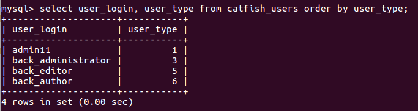
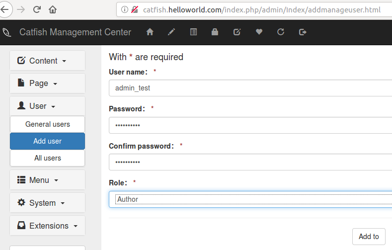

## Catfish CMS 4.9.0 CSRF

CSRF vulnerability is caused by adding user without adding role permission filtering.  

Normally the system has only one super administrator whose type is 1 and other user. Like this,  
  
We can see that admin11 is the super administrator(type=1). admin11 can add "Administrator"(type=3), "Editor"(type=5), "Author"(type=6)

After logging in as an administrator, view the current background user as follows,  
  

We can add a super administrator with type 1 through CSRF vulnerability, as follows,  
1. Add user, select the role as Author  
  
2. Use burpsuite to intercept request, click "Add to", you can see that juese=6 and the type is "author"  
  
Make the juese=6 to juese=1 and forward the request  
  
No new user with the role of "author" is generated in the background users.  
  

3. Look at the database and find an extra super administrator user(admin_test, type=1):  
  

4. Log in with admin_test.  
  
We can successfully login and manage CMS, and the original super administrator admin11 can't find the user admin_test without looking at the database.  