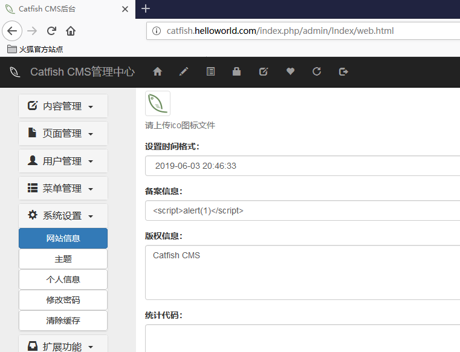
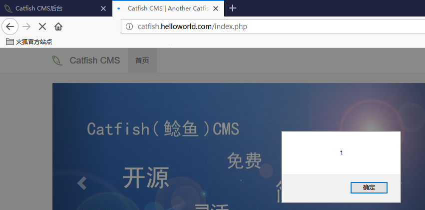

## Catfish CMS 4.9.0 XSS

After logging in as an administrator, go to "System->Website information", then change "备案信息" or "Copyright Information" or "Statistical code", the XSS vulnerabilities can be triggered.  

For example, edit on this page, `http://*****/index.php/admin/index/web.html`  
  

Go to the page, `http://*****/index.php`  
